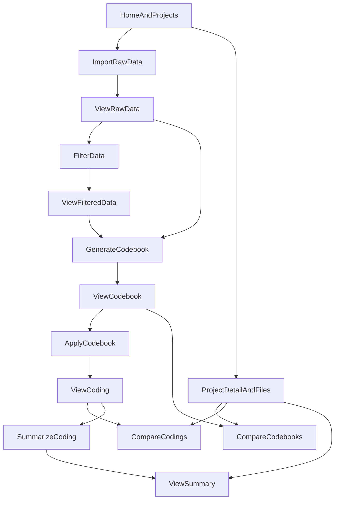

# Web App Features and Workflow

## Scope

This document explains the full web app workflow, major features, and implementation rationale for the qualitative coding tool.

Out of scope by request: login and register flow details.

## What the app does

The app supports a qualitative analysis pipeline over social/text data:

1. organize work in projects,
2. import raw data,
3. inspect and optionally filter data,
4. generate and refine codebooks,
5. apply codebooks to produce coding outputs,
6. compare codebooks/codings,
7. summarize coding outputs,
8. view saved summaries.

## High-level architecture

### Frontend architecture (React)

- Routing is centralized in `frontend/src/App.jsx`, with protected routes for tool workflows.
- Shared layout (`frontend/src/components/shell/PageShell.jsx` + `Panel.jsx`) keeps every screen consistent: one toolbar title, and for the form pages (Import, Filter, Generate, Apply, Compare, Summarize) two side-by-side panels — source on the left, output and instructions on the right — over a centered primary button.
- Reusable panel data loading (`frontend/src/components/tool-panels/useToolPanelData.js`) fetches raw DBs, filtered DBs, projects, and optional codebooks in parallel.
- Frontend request builders in `frontend/src/lib/apiContracts.js` mirror backend schema requirements and validate required fields before network calls.

Why this structure:

- keeps each page thin and feature-focused,
- reduces duplication in forms and API wiring,
- catches missing input early instead of relying only on backend 422 validation.

### Backend architecture (FastAPI + PostgreSQL)

- API entrypoint in `backend/app/main.py` mounts all routes under `/api`.
- Domain routers in `backend/app/api/*_routes.py` split features by responsibility (files, data, codebook, coding, content, projects, prompts).
- Metadata is tracked in relational tables (`users`, `projects`, `files`, `project_files`) in `backend/app/database.py` — a `files` row is a git-style ref (identity only, no content).
- Heavy artifact content lives in a small set of fixed, indexed tables keyed by `file_id`: `submissions`/`comments` (`backend/app/storage_models.py`) plus the artifact-version spine in `backend/app/versioning_models.py` — `artifact_versions` (one commit per save), `artifact_edges` (typed, ordered, version-pinned derivation between artifacts), and `codebook_codes` (per-version, per-code rows keyed by a stable `code_uid`). `coding_entries` (`backend/app/storage_models.py`) is SCD-2 range-versioned by `code_uid`/`valid_from`/`valid_to`. `files.schemaname` is retained as an opaque identifier string (`proj_<hex>` / `cmp_<hex>` / `sum_<hex>`) that the frontend still passes around, but it is no longer a real Postgres schema — every repository resolves it to `files.id` via `backend/app/repositories/file_repo.py::resolve_file_id` and queries the fixed tables by `file_id`. The old per-artifact dynamic schemas (`proj_*`/`cmp_*`/`sum_*`, each created via `CREATE SCHEMA IF NOT EXISTS`) still physically exist as a read-only rollback fallback and have not been dropped yet — see `documentation/architecture.md` for the full storage model.
- AI pipelines live in reusable scripts under `backend/scripts/` (`filter_db.py`, `codebook_generator.py`, `codebook_apply.py`, `summarize_coding.py`).

Why this structure:

- separates small relational metadata from large content payloads,
- supports lineage tracking between artifacts via typed, version-pinned `artifact_edges`, and full revision history via `artifact_versions` (see `backend/app/services/version_service.py`),
- keeps HTTP route handlers thinner while AI workflows remain reusable.

## Core artifact model

The platform is built around file artifacts linked to projects and dependencies:

- `raw_data`: uploaded source dataset
- `filtered_data`: derived subset/cleaned dataset
- `codebook`: coding scheme generated or edited by users
- `coding`: coded output from applying a codebook
- `codebook_comparison` / `coding_comparison`: comparison outputs
- `summary`: summarized interpretation of coding output

Every derived artifact can reference its parent artifact(s), which enables traceable workflow lineage.

## End-to-end workflow

## Feature-by-feature implementation

## 1) Home and Project Management

User-facing behavior:

- Users land on Home after authentication and can create/open projects.
- Project page shows grouped files and action shortcuts.

Frontend implementation:

- Home page and hook: `frontend/src/pages/Home.jsx`, `frontend/src/components/project/useHomePage.js`
- Project page and composition: `frontend/src/pages/Project.jsx`
- Project file UI/actions: `frontend/src/components/project/ProjectFilesSection.jsx`, `frontend/src/components/project/FileRowActions.jsx`, `frontend/src/components/project/useProjectPage.js`

Backend implementation:

- `GET /api/projects/`
- `POST /api/create-project/`
- `POST /api/update-project/`
- `POST /api/rename-file/`
- `GET /api/my-files/`

Why implemented this way:

- project-centric file organization gives a single control point for downstream workflow navigation,
- shared project/file metadata supports cross-feature consistency.

## 2) Import Data

User-facing behavior:

- Upload `.zst` data into a project as a raw dataset artifact.

Frontend implementation:

- Page: `frontend/src/pages/Import.jsx`
- Upload component: `frontend/src/components/data/FileUpload.jsx`

Backend implementation:

- `POST /api/upload-zst/`
- Ingest and DB write path through file routes and import script infrastructure.

Why implemented this way:

- upload produces a first-class artifact (`raw_data`) used by all later pipeline stages,
- project linkage at import time keeps workflow traceable.

## 3) View Data / View Filtered Data

User-facing behavior:

- Browse imported raw data and filtered datasets with table-level interaction.

Frontend implementation:

- Pages: `frontend/src/pages/Data.jsx`, `frontend/src/pages/FilteredData.jsx`
- Shared data-browser logic: `frontend/src/components/data/useDataBrowserPage.js`
- Table and detail UI: `frontend/src/components/data/DataTable.jsx`, `frontend/src/components/data/EntryModal.jsx`

Backend implementation:

- `GET /api/file-entries/`
- `GET /api/comments/{submission_id}`
- `POST /api/post-contents/`
- `GET /api/word-count-ranges/`
- `POST /api/delete-row/`
- `POST /api/move-rows/`

Why implemented this way:

- one reusable browser flow supports both raw and filtered modes,
- mode-specific behavior is configured without duplicating core table logic.

## 4) Filter Data

There are **two ways** to produce a `filtered_data` artifact. Both create a
structurally identical artifact (same lineage pin, same row copy, same counts) --
they differ only in how the row set is chosen and in the `origin` recorded on v1.

### 4a) One-shot AI filter (`/filter`)

User-facing behavior:

- Create filtered datasets using prompt/model criteria and optional tags/sampling.
  The AI's selection *is* the result; there is no review step.

Frontend implementation:

- Page: `frontend/src/pages/Filter.jsx`
- Panel: `frontend/src/components/tool-panels/FilterDataPanel.jsx`
- Request builder: `buildFilterDataForm` in `frontend/src/lib/apiContracts.js`

Backend implementation:

- `POST /api/filter-data/` -> `data_service.start_filter_data_job` -> job type `filter_data`
- Uses filtering pipeline logic under `backend/scripts/filter_db.py` and tag expansion logic.
- v1 is recorded with `origin="generated"` and full LLM provenance.

### 4b) Filter editor (`/filter-editor`)

User-facing behavior:

- Read the source rows and mark each one **included**, **excluded**, or leave it
  undecided; name the new database and assign it to a project; submit.
- The AI filter is available *inside* the screen as an assistant: it proposes rows
  from the undecided pool only, they arrive pre-checked and badged `(added by AI)`,
  and it can be re-run as often as the user likes. Nothing is created until submit.
- Reached from the **Filter** button in the data viewer's header, or from the sidebar.

Frontend implementation:

- Page: `frontend/src/pages/FilterEditor.jsx`
- Components: `frontend/src/components/filter-editor/` (`FilterEditor.jsx`,
  `FilterAiPanel.jsx`, `FilterEditorTable.jsx`, `useFilterEditorState.js`)
- Selection logic (pure, unit-tested): `frontend/src/lib/filterEditorState.js`,
  persisted to `localStorage` per source database so a refresh or a multi-minute
  AI run doesn't lose the work.
- Request builders: `buildFilterPreviewPayload` / `buildManualFilterPayload`.

Backend implementation:

- `POST /api/filter-preview/` -> job type `filter_preview`. Runs the same AI pass
  as 4a (`data_service._run_ai_filter`, shared by both jobs) but **creates nothing**
  -- it returns the row ids it would keep. Already-decided ids are sent along and
  removed from the candidate pool before sampling (`_sample_source_rows`'s
  `exclude_*` arguments), which is what makes repeated runs propose new rows.
- `POST /api/filtered-data/manual` -> `data_service.create_manual_filtered_data`.
  Synchronous (no LLM call), reusing `_materialize_filtered_schema` with
  `origin="edited"` and no `system_prompt`/`prompt_meta`.

Why implemented this way:

- filtering is an explicit transformation stage that creates a new artifact
  (`filtered_data`) rather than mutating source data,
- sampled + prompt-driven strategy supports iterative analysis workflows,
- an AI assist during editing is deliberately **not** recorded as LLM provenance:
  `origin`/`model`/`system_prompt` must stay usable for auditing which artifacts a
  model actually generated.

## 4c) Row memos

User-facing behavior:

- Write a free-text analytic memo on any row, from the raw data viewer, the
  filtered data viewer, or the filter editor -- all three open the same row modal.
- A row that has a memo shows a `✎` marker in the table.
- Memos follow their row into any artifact derived from it, so a note written while
  filtering is still there when that row is opened in the resulting filtered
  database (or later in the coding workspace).

Frontend implementation:

- `frontend/src/components/data/MemoEditor.jsx` (inside `EntryModal.jsx`),
  `MemoIndicator.jsx`, and the shared `useRowMemos.js` hook (one fetch per database).

Backend implementation:

- `GET /api/memos/?schema=...` and `PUT /api/memos/` (`backend/app/api/memo_routes.py`)
- `backend/app/services/memo_service.py`, `backend/app/repositories/memo_repo.py`,
  `storage_models.py::RowMemo`, Alembic revision `c8f1b04e7a29`.

Why implemented this way:

- distinct from `CodingEntry.notes`, which annotates a single coded *quote* and only
  exists once a codebook has been applied -- a memo attaches to the row itself and is
  available from the moment data is imported,
- scoped per artifact row (`file_id` + `row_type` + `row_id`) and copied forward at
  every row-copy site, matching the self-contained-artifact model `coding` already uses,
- deliberately not SCD-2 range-versioned: a memo is commentary *about* an artifact,
  not artifact content, so it is not what a version diff describes.

## 5) Generate and View Codebook

User-facing behavior:

- Generate codebooks from selected datasets and inspect/edit them.

Frontend implementation:

- Generate page/panel: `frontend/src/pages/GenerateCodebook.jsx`, `frontend/src/components/tool-panels/GenerateCodebookPanel.jsx`
- View page/hook/workspace: `frontend/src/pages/ViewCodebook.jsx`, `frontend/src/components/codebook/useViewCodebookPage.js`, `frontend/src/components/codebook/CodebookWorkspaceSection.jsx`

Backend implementation:

- `POST /api/generate-codebook/`
- `GET /api/codebook`
- `GET /api/parse-codebook`
- `GET /api/list-codebooks`
- `POST /api/save-file-codebook/`

Why implemented this way:

- generation and viewing are separated so users can iterate between automated draft and manual refinement,
- parse and save endpoints support both markdown and structured editing experiences.

## 6) Apply Codebook and View Coding

User-facing behavior:

- Apply a selected codebook to a selected database (optionally a sampled subset via the Sample Size slider); the AI codes every sampled post and comment, coded or not.
- View Coding shows the resulting artifact: the codebook (editable), a paged table of every row the artifact owns — coded or uncoded — with per-row inline code/evidence/notes editing, and a read-only Text View rendering.
- Select any subset of rows and re-run the AI classifier over just that subset with a chosen model (Recode); the result is staged as reviewable proposals in the same editing session as manual tags and codebook edits, not written until Save.
- Manual tagging, codebook edits, and accepted recode proposals all accumulate in one editing session; Save Changes commits everything together as exactly one new version.
- Duplicate forks the whole saved artifact (codebook snapshot, its own rows, its coding, lineage, project links) under a new name.

Frontend implementation:

- Apply page/panel: `frontend/src/pages/ApplyCodebook.jsx`, `frontend/src/components/tool-panels/ApplyCodebookPanel.jsx`
- Coding workspace: `frontend/src/pages/ViewCoding.jsx`, `frontend/src/components/coding-table/workspace/useViewCodingPage.js`, `frontend/src/components/coding-table/workspace/CodingWorkspaceSection.jsx`
- Row filter/paging toolbar and AI-recode bar: `frontend/src/components/coding-table/workspace/CodingRowsToolbar.jsx`, `frontend/src/components/coding-table/workspace/CodingRecodeBar.jsx`
- Read-only rendered text tab: `frontend/src/components/coding-table/workspace/CodingTextView.jsx`
- Fork-the-whole-artifact control: `frontend/src/components/coding-table/workspace/CodingDuplicateControl.jsx`
- Table itself (select column, inline per-row code/evidence/notes editor): `frontend/src/components/coding-table/CodingTableView.jsx`, `CodingTableRow.jsx`, `CodingTableEditRow.jsx`
- Request builders: `buildApplyCodebookForm`/`buildRecodeItemsPayload` in `frontend/src/lib/apiContracts.js`

Backend implementation:

- `POST /api/apply-codebook/` — kicks off the background job that samples, classifies, and builds the self-contained coding artifact
- `GET /api/coding/{ref}` — codebook snapshot + parsed tree + row/coded counts + code frequency
- `GET /api/coding/{ref}/rows` — one page of the artifact's own rows (`limit`/`offset`/`only=all|coded|uncoded`/`code`/`q`), each with its codes
- `GET /api/coding/{ref}/text` — read-only canonical text, rendered fresh from `coding_entries`
- `PUT /api/coding/{ref}/revision` — save the whole editing session (an updated codebook snapshot, updated row coding, or both) as at most one new version
- `PATCH /api/coding/{ref}` — rename / re-describe
- `POST /api/coding/{ref}/duplicate` — fork the whole artifact
- `POST /api/coding/{ref}/recode` — kick off a background job that reclassifies a chosen subset of rows with a chosen model and returns the classification as proposals (nothing is written until the caller saves them via `PUT .../revision`)
- `GET /api/coding-comparison` — a `coding_comparison` artifact's markdown (a blob-storage artifact type; content lives on `artifact_versions.content`, read via `version_service.read_blob`)

Why implemented this way:

- a coding artifact is **self-contained**: it owns its own codebook snapshot, its own copy of every sampled submission/comment, and its coding (`coding_entries` — the sole source of truth, including rows with zero codes), so the viewer never re-derives row text or the codebook from a parent artifact at view time (see CLAUDE.md's "Core artifact model"),
- coding output is stored as a separate artifact (`coding`) to preserve reproducibility and allow edits/versioning,
- supports both schema-reference and file-id codebook input for flexible source selection,
- recoding a chosen subset (rather than the whole artifact) keeps AI cost proportional to how much a researcher actually wants re-examined, and never touches rows outside the selection.

## 7) Compare Codebook and Compare Coding

User-facing behavior:

- Compare two codebooks or two coding outputs and save comparison artifacts.

Frontend implementation:

- Pages: `frontend/src/pages/CompareCodebook.jsx`, `frontend/src/pages/CompareCoding.jsx`
- Shared compare container and data hook: `frontend/src/components/compare/ComparePageContainer.jsx`, `frontend/src/components/compare/useComparePageData.js`

Backend implementation:

- `POST /api/compare-codebooks/`
- `POST /api/compare-codings/`
- `POST /api/save-comparison/`

Why implemented this way:

- single configurable compare UI avoids duplicate page logic,
- saved comparison artifacts can be revisited and linked to projects like other outputs.

## 8) Summarize Coding and View Summary

User-facing behavior:

- Generate summary text from coding artifacts and browse saved summaries.

Frontend implementation:

- Summarize page/hook: `frontend/src/pages/SummarizeCoding.jsx`, `frontend/src/components/summarize/useSummarizeCodingPage.js`
- View summary page/hook: `frontend/src/pages/ViewSummary.jsx`, `frontend/src/components/summarize/useViewSummaryPage.js`

Backend implementation:

- `POST /api/summarize-coding/`
- `POST /api/save-summary/`
- `GET /api/summary/{summary_id}`

Why implemented this way:

- run-vs-view split mirrors other pipeline stages (generate/view, apply/view),
- summary storage as a first-class artifact allows project traceability and reuse.

## Cross-cutting implementation patterns

### Protected workflows

- Most feature routes are wrapped by `ProtectedRoute` in `frontend/src/App.jsx`.
- This keeps tool pages inaccessible to anonymous sessions while sharing common shell/nav.

### Shared tool panel data loading

- `useToolPanelData` preloads raw DBs, filtered DBs, projects, and optional codebooks.
- This creates a predictable source selection UX across multiple tool panels.

### Contract symmetry between frontend and backend

- `frontend/src/lib/apiContracts.js` mirrors backend `backend/app/api/schemas.py` field expectations.
- Required-field checks are done early in the client for clearer user feedback.

### Lineage and traceability

- `artifact_edges` (in `backend/app/versioning_models.py`) captures typed, ordered, version-pinned parent-child artifact relationships, replacing the old untyped `file_dependencies` table.
- `artifact_versions` gives every artifact a full revision history (see "Artifact versioning" above / `documentation/architecture.md`), so lineage and revision are tracked as two separate, explicit concerns rather than one table conflating them.
- This supports reproducible analysis chains across import -> filter -> codebook -> coding -> summary, and lets the UI walk the DAG via `GET /api/artifacts/{ref}/lineage` (`frontend/src/pages/Lineage.jsx`).

## Why the overall workflow is implemented this way

- **Pipeline clarity:** each transformation produces a new artifact, avoiding destructive overwrites.
- **Traceability:** typed, version-pinned edges preserve exact provenance for qualitative analysis decisions.
- **Modularity:** separate route modules and script modules keep feature growth manageable.
- **UI consistency:** shared tool-page/panel patterns reduce cognitive load and implementation drift.
- **Iterative research support:** users can branch from raw or filtered data, compare alternatives, and summarize results without losing intermediate states.

## Route and endpoint reference (excluding login/register details)

Frontend routes (`frontend/src/App.jsx`):

- `/`
- `/import`
- `/data`
- `/project/:projectId`
- `/filter`
- `/filter-editor`
- `/filtered-data`
- `/codebook-generate`
- `/codebook-view`
- `/codebook-apply`
- `/coding-view`
- `/compare-codebook`
- `/compare-coding`
- `/summarize-coding`
- `/summaryview`

Main backend endpoints by domain:

- Files/data management: `/api/upload-zst/`, `/api/file-entries/`, `/api/comments/{submission_id}`, `/api/post-contents/`, `/api/delete-row/`, `/api/move-rows/`
- Project/file metadata: `/api/projects/`, `/api/create-project/`, `/api/update-project/`, `/api/rename-file/`, `/api/my-files/`
- Filtering: `/api/filter-data/`, `/api/filter-preview/`, `/api/filtered-data/manual`, `/api/word-count-ranges/`
- Row memos: `/api/memos/` (GET, PUT)
- Codebook: `/api/generate-codebook/`, `/api/codebook`, `/api/parse-codebook`, `/api/list-codebooks`, `/api/save-file-codebook/`, `/api/compare-codebooks/`
- Coding and summarization: `/api/apply-codebook/`, `/api/coding/{ref}`, `/api/coding/{ref}/rows`, `/api/coding/{ref}/text`, `/api/coding/{ref}/codebook` (PUT), `/api/coding/{ref}/rows` (PUT), `/api/coding/{ref}` (PATCH), `/api/coding/{ref}/duplicate`, `/api/coding/{ref}/recode`, `/api/coding-comparison`, `/api/compare-codings/`, `/api/summarize-coding/`, `/api/save-comparison/`, `/api/save-summary/`, `/api/summary/{summary_id}`

